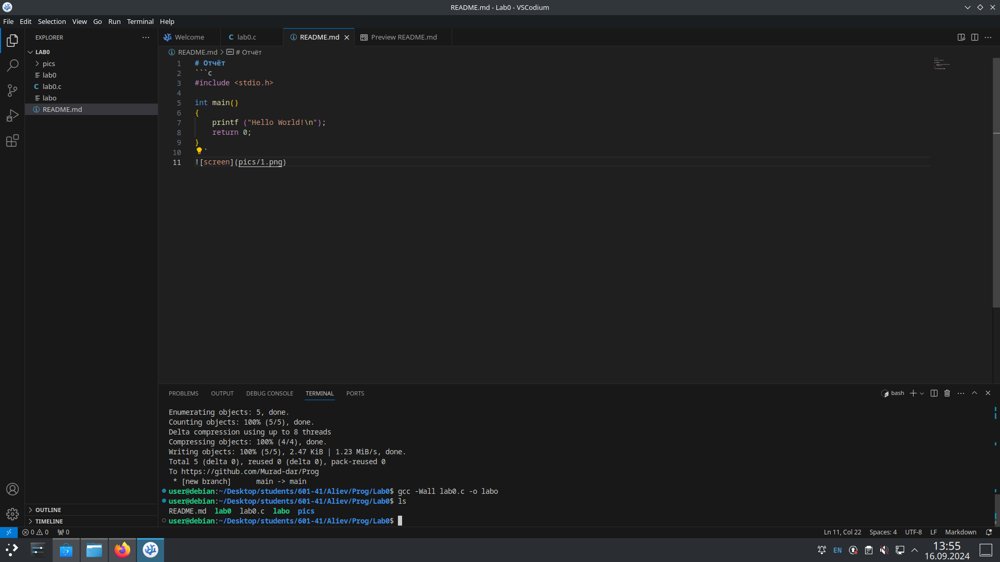
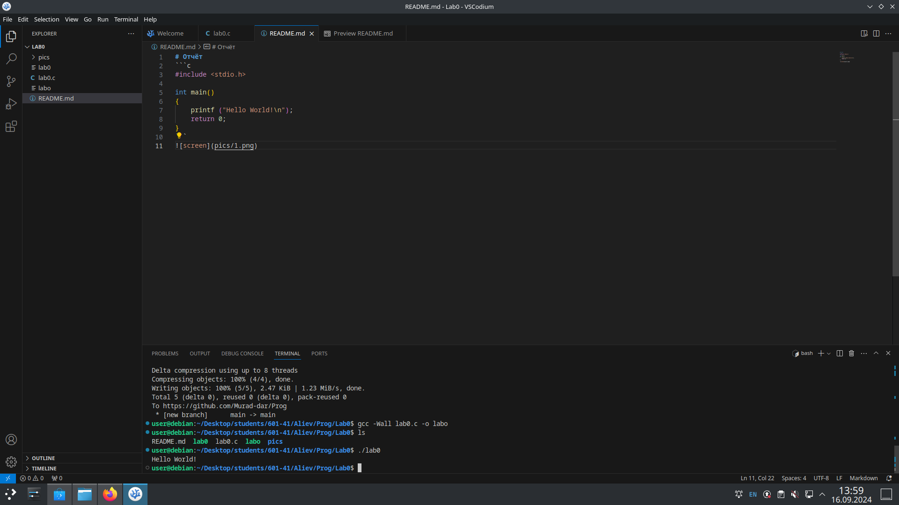
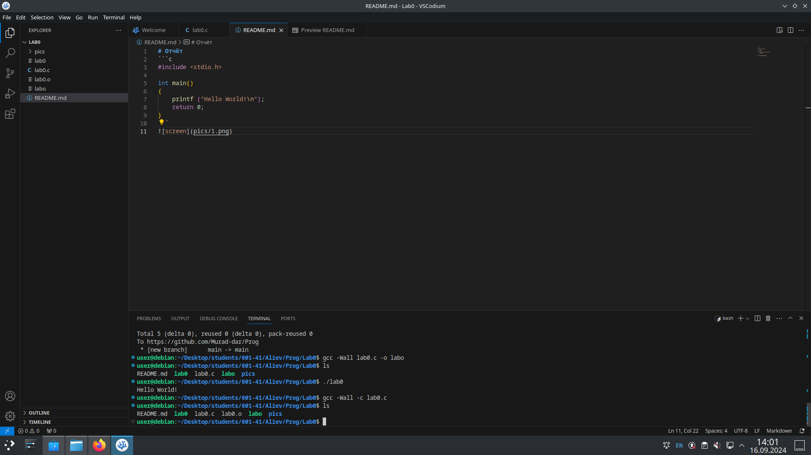
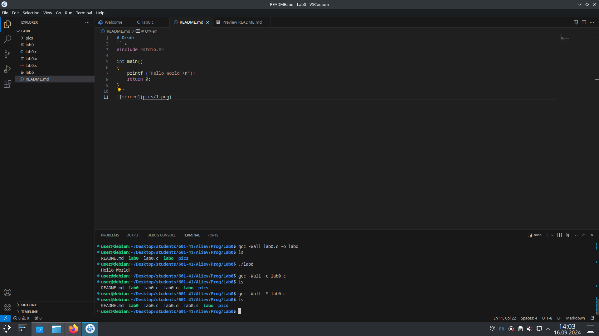
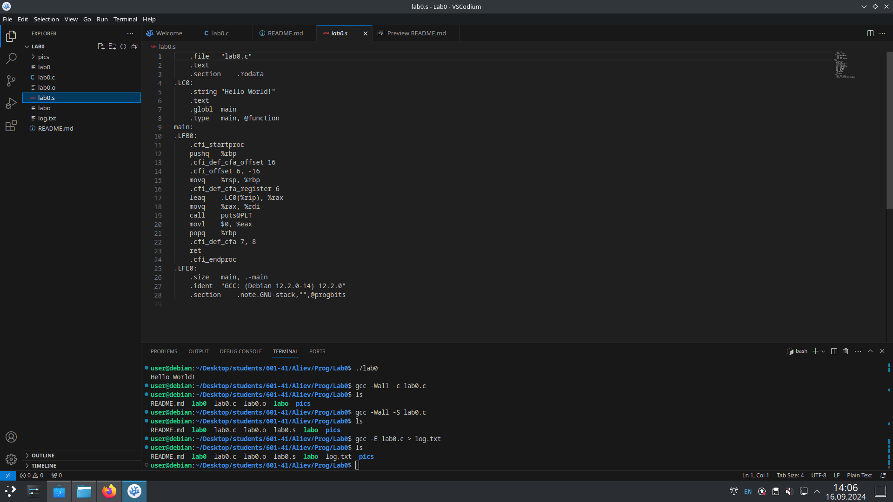
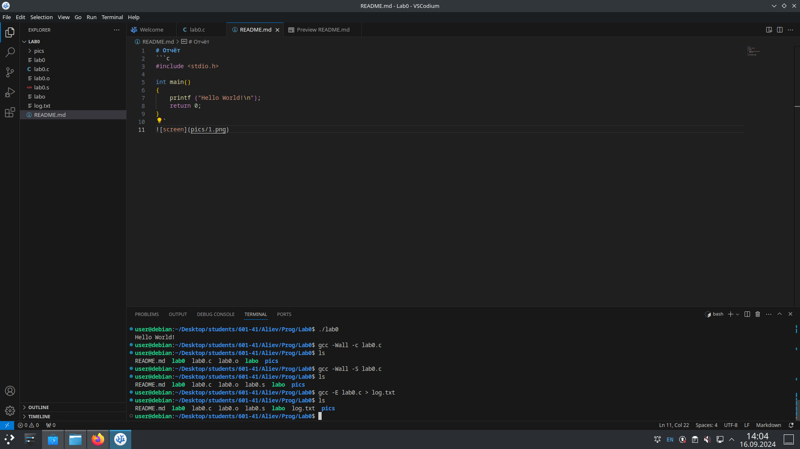

# Отчёт
1. Создайте репозиторий для дисциплины на GitHub.

2. Склонируйте его себе на ПК.

3. Напишите свою первую программу.

4. Скомпилируйте и запустите её.

5. Получите по отдельности результаты каждого этапа компиляции.

6. Напишите отчёт в README.md. Отчёт должен содержать:

## Задание

1. Описание проделанной работы

2. Консольные команды

3. Скриншоты результатов

4. Ссылки на используемые материалы

5. Сделайте коммит и пуш.

6. Добавьте для себя в отчёт шпаргалку по работе с git.

## Исходный код программы:
```c
#include <stdio.h> 

int main()
{
    printf ("Hello World!\n");
    return 0;
}
```

## Этапы сборки программы:

### Сбрка программы с помощью компилятора gcc:


### Рельзультат запуска программы lab0:

add -A 
### Получение объуктного файла lab0.o:


### Получение ассемблерного кода:



### Результат обработки исходного кода препроцессором:

