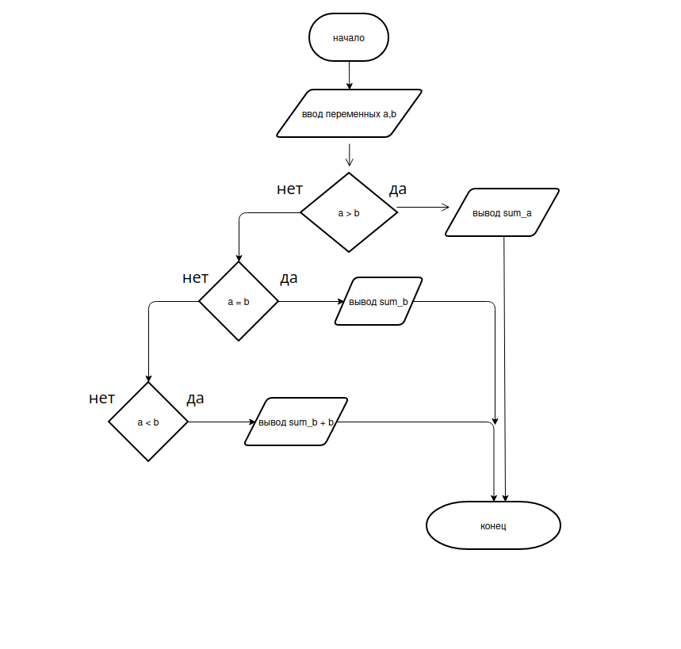

# Лабараторная работа 1

## Задания для самостоятельного выполнения

1. Разберите код программы из примера.
2. Составьте блок-схему алгоритма для своего варианта.
3. Напишите программу, решающую задачу по своему варианту.
4. Оформите отчёт в README.md. Отчёт должен содержать:
    - Задание
    - Описание проделанной работы
    - Скриншоты результатов
    - Блок-схему
## Задание(Вариант 1)
1. Вывести сумму цифр числа a если она больше b, если равна b - сообщение Сумма цифр = b, и значение суммы, увеличенное на b, если сумма меньше b.

## Программа:

```c
#include <stdio.h>

int calc_sum_digits(int number)
{
    int sum = 0;
    int rest;
    while(number != 0){
        rest = number % 10;
        sum = sum + rest;
        number = number / 10;
    } 
    return sum;
}


int main()
{
    int a, b;
    printf("Enter a -> ");
    scanf("%d", &a);
    printf("Enter b -> ");
    scanf("%d", &b);
   

    if (!a && !b)
        return 0;

    int sum_a = calc_sum_digits(a);
    int sum_b = calc_sum_digits(b);
    
    if (sum_a > b)
        printf("sum_a = %d\n", sum_a);
    if (sum_a == b)
        printf("sum_b = %d\n", sum_b);
    if (sum_a < b)
        printf("sum_b + b = %d\n", sum_b + b);

    return 0;
}
```

# 2. Блок-схема для программы

