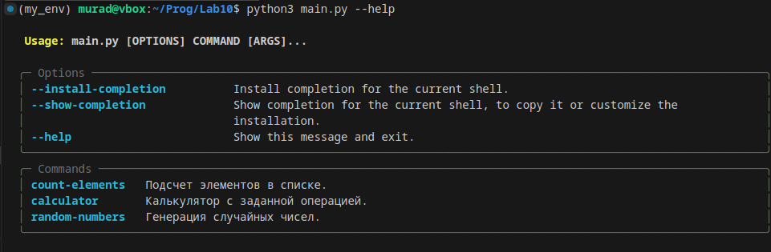

# Лабораторная работа №10 
## Задание
Создайте пакет, содержащий 3 модуля на основе лабораторных работ №№ 7-9
Напишите запускающий модуль на основе Typer, который позволит выбирать и настраивать параметры запуска логики из пакета.
Оформите отчёт в README.md. Отчёт должен содержать:

    Условия задач
    Описание проделанной работы
    Скриншоты результатов
## Ход работы

## Создание файлов

В папке Lab10 создал три файла для лабораторных работ и один файл для запуска:

- lab7.py
- lab8.py
- lab9.py
- main.py

## Написание кода
1. Содержимое файла lab7.py
```python
# lab7.py

def count(lst):
    """Подсчет числа элементов в списках, включая вложенные списки (рекурсивно)."""
    total = 0
    for item in lst:
        if isinstance(item, list):
            total += count(item)  # Рекурсивный вызов для вложенных списков
        else:
            total += 1
    return total

def count_non_recursive(lst):
    """Подсчет числа элементов в списках, включая вложенные списки (без рекурсии)."""
    stack = [lst]
    total = 0
    while stack:
        current = stack.pop()
        for item in current:
            if isinstance(item, list):
                stack.append(item)
            else:
                total += 1
    return total
```
2. Содержимое файла lab8.py
```python
# lab8.py

def make_calc(operation, initial=0):
    """Замыкание-калькулятор, накапливающее результат."""
    result = initial

    def calc(value):
        nonlocal result
        if operation == "+":
            result += value
        elif operation == "-":
            result -= value
        elif operation == "*":
            result *= value
        elif operation == "/":
            result /= value
        return result

    return calc
```
3. Содержимое файла lab9.py
```python
# lab9.py

import random

def random_number_generator(start, end):
    """Генератор случайных чисел в заданном диапазоне."""
    while True:
        yield random.randint(start, end)
```
4. Содержимое файла lab9.py
```python
# main.py

import typer
from lab7 import count, count_non_recursive
from lab8 import make_calc
from lab9 import random_number_generator

app = typer.Typer()

@app.command()
def count_elements(lst: str, recursive: bool = True):
    """Подсчет элементов в списке."""
    import ast
    parsed_list = ast.literal_eval(lst)
    if recursive:
        result = count(parsed_list)
    else:
        result = count_non_recursive(parsed_list)
    typer.echo(f"Количество элементов: {result}")

@app.command()
def calculator(operation: str, initial: float = 0):
    """Калькулятор с заданной операцией."""
    calc = make_calc(operation, initial)
    while True:
        value = typer.prompt("Введите число (или 'exit' для выхода)")
        if value.lower() == 'exit':
            break
        calc_value = calc(float(value))
        typer.echo(f"Текущий результат: {calc_value}")

@app.command()
def random_numbers(start: int, end: int, count: int):
    """Генерация случайных чисел."""
    generator = random_number_generator(start, end)
    numbers = [next(generator) for _ in range(count)]
    typer.echo(f"Случайные числа: {numbers}")

if name == "main":
    app()
```
## Установка typer
1. python3 -m venv my_env
2. source my_env/bin/activate
3. pip install typer requests
## Запуск программы
- Для подсчета элементов в списке 
```python
python main.py count-elements "[1, 2, [3, 4, [5]]]" --recursive
```
- Для использования калькулятора
```python
python main.py calculator "+" --initial 10
```
- Также для спраки можно воспользоваться командой python3 main.py --help

