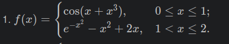
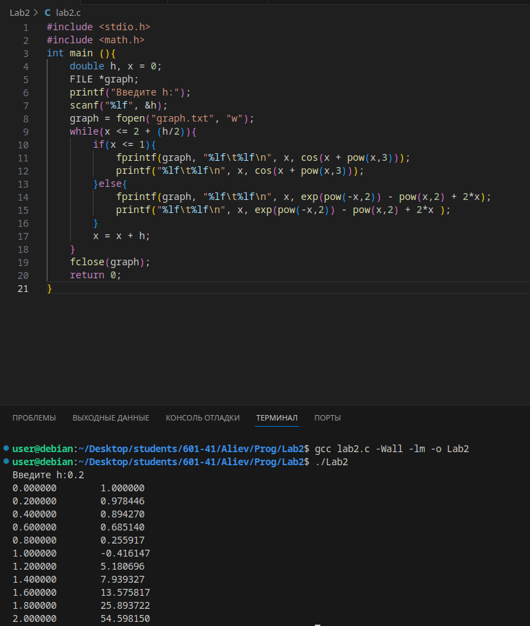
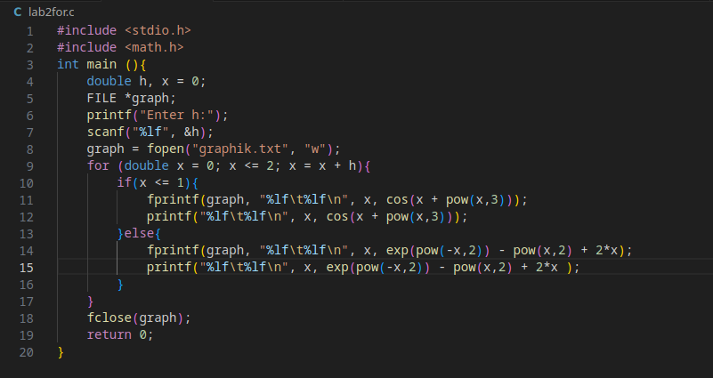
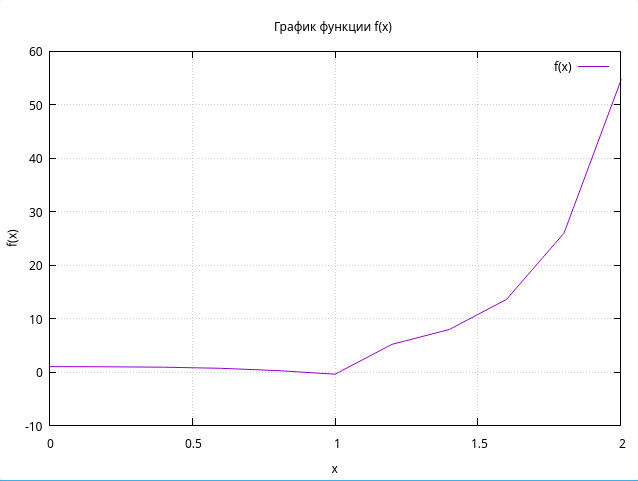

# Лабораторная работа 2
## Задание 
1. Напишите программу по варианту, используя оператор цикла while.
2. Напишите программу, используя оператор цикла for.
3. Постройте график с использованием gnuplot.
4. Составьте блок-схемы.
5. Оформите отчёт в README.md. 
## Отчет должен содержать:
1. Описание проделанной работы
2. Скриншоты результатов
3. Блок-схемы
4. График 

## Вариант 1

## Код с While

## Код с for

- создал текстовый файл для сохранения вывода
- сделал график с помощью команды gnuplot graphs.gnu

# График

