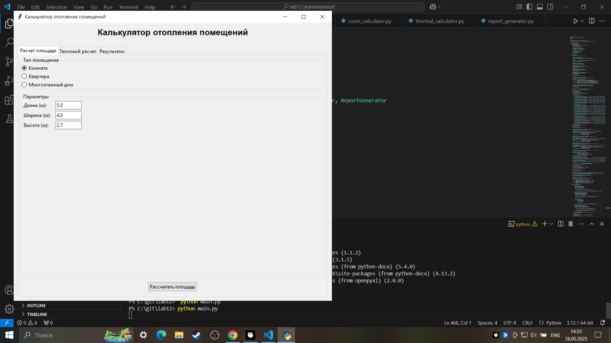
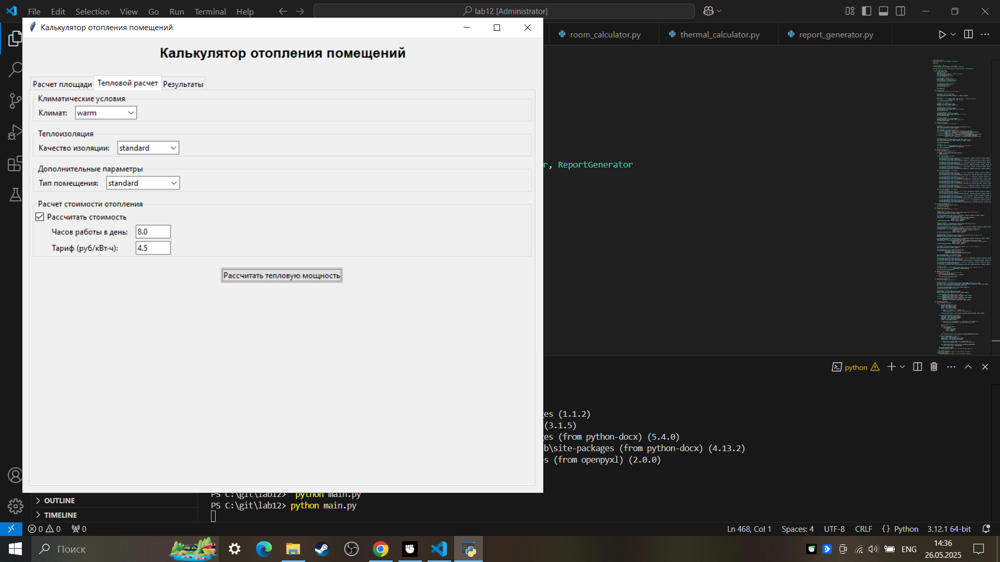
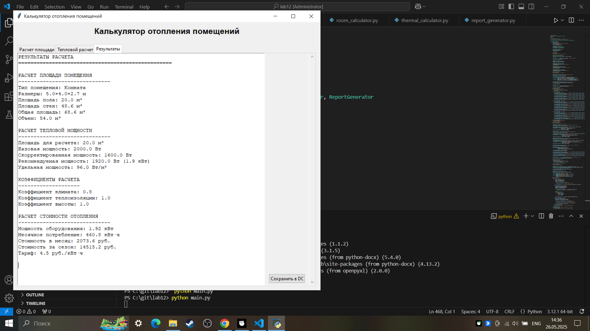

# Лабораторная работа №12
## Задания для самостоятельного выполнения
Сложность: Rare
По своему варианту задания и GUI фреймворка создайте пакет, содержащий 3 модуля, и подключите его к основной программе. Основная программа должна предоставлять:
- графический пользовательский интерфейс с возможностями ввода требуемых параметров и отображения результатов расчёта,
- возможность сохранить результаты в отчёт формата .doc или .xls (например, пакеты python-docx и openpyxl).графический пользовательский интерфейс с возможностями ввода требуемых параметров и отображения результатов расчёта,
## Мой GUI-ФРЕЙМВОР - Tkinter
# Задание варианта 2:
Помещения:
-Комната
-Квартира
-Многоэтажный дом
Расчёт общей площади помещения, тепловой мощности для обогрева помещения.
### Решение:
## Шаг 1 создание структуры задания
- Откройте командную строку и выполните следующие команды для создания директории проекта
```
mkdir main.py
```
##  сделать подпапку heating_package
В подпапке создайте 4 файла : __init__.py, room_calculator.py, thermal_calculator.py,report_generator.py
## Шаг 2 Установка зависимостей
Откройте командный текст в проекте и выполните:
-pip install python-docx openpyxl
## Вставить код в __init__.py
```
from .room_calculator import RoomCalculator
from .thermal_calculator import ThermalCalculator  
from .report_generator import ReportGenerator

__all__ = ['RoomCalculator', 'ThermalCalculator', 'ReportGenerator']
__version__ = '1.0.0'
```
## создадим простую версию main.pyдля проверок:
```
import tkinter as tk
from tkinter import ttk, messagebox

class HeatingCalculatorGUI:
    def __init__(self, root):
        self.root = root
        self.root.title("Калькулятор отопления")
        self.root.geometry("400x300")
        
        label = ttk.Label(root, text="Калькулятор отопления работает!")
        label.pack(pady=50)
        
        button = ttk.Button(root, text="Тест", command=self.test)
        button.pack()
    
    def test(self):
        messagebox.showinfo("Тест", "Интерфейс работает!")

if __name__ == "__main__":
    root = tk.Tk()
    app = HeatingCalculatorGUI(root)
    root.mainloop()
```
-Запустите :python main.py

-Проверили открывается ли окно, окно открылось значит можно начать добавлять код в остальные файлы

- __init__.py - Пакет для расчета площади помещений и тепловой мощности
- room_calculator.py - Модуль для расчета площади различных типов помещений
- thermal_calculator.py - Модуль для расчета тепловой мощности для обогрева помещений
- report_generator.py - Модуль для генерации отчетов в форматах DOC и XLS
- main.py - Основная программа с графическим интерфейсом для расчета отопления помещений

### Результат






