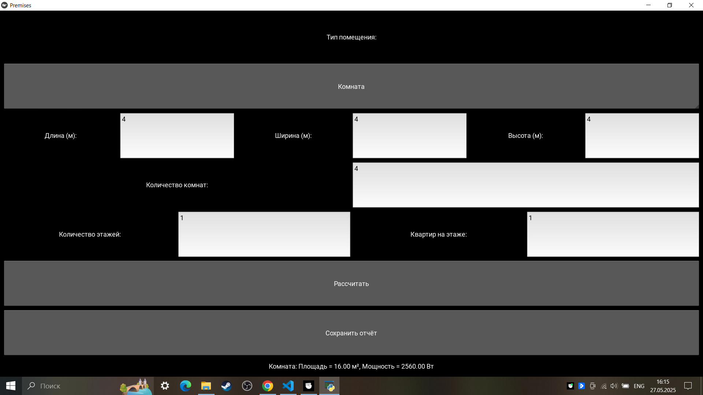

# Лабораторная работа №13
Перепишите свой вариант лабораторной работы №12 с использованием классов и объектов.
Задание то же, вариант GUI фреймворка возьмите следующий по списку.
В коде должны присутствовать:
- абстрактный базовый класс и соотвествующие декораторы для методов
- иерархия наследования
- managed - атрибуты
- минимум 2 dunder-метода у подклассов
## Описание проделанной работы 
- создали директорию для работы
- написали код 
## Описание работы программы
- GUI (Kivy):
- Интерфейс включает выпадающий список для выбора типа помещения (комната, квартира, дом).
- Поля ввода для длины, ширины, количества комнат (для квартиры), этажей и квартир на этаже (для дома).
- Кнопка "Рассчитать" выполняет расчёт площади и тепловой мощности.
- Кнопка "Сохранить отчёт" сохраняет результаты
## Классы и объекты:
Абстрактный класс Premise (в room.py) определяет абстрактные методы calculate_area, calculate_heating_power и свойства area, heating_power.
Класс Room наследуется от Premise, использует managed-атрибуты length, width, включает __str__ и __repr__.
Класс Apartment наследуется от Premise, использует Room, добавляет managed-атрибут rooms, включает __str__ и __repr__.
Класс Building наследуется от Premise, использует Apartment, добавляет managed-атрибуты floors, apartments_per_floor, включает __str__ и __repr__.
## Расчёты:
- Площадь:
- Комната: длина × ширина.
- Квартира: площадь комнаты × количество комнат.
- Дом: площадь квартиры × количество квартир на этаже × количество этажей.
- Тепловая мощность: площадь × 100 Вт/м².

