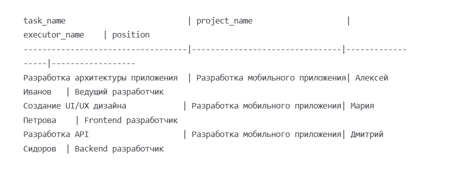

# Лабораторная работа №14: Основы БД

## Условия задачи
- Спроектировать исходные данные для учета задач в проекте, включающую:

- Таблица проектов : информация о проектах (название, описание, статус)
- Таблица задач : информация о задачах, границах с проектами (описание, статус выполнения, сроки)
- Таблица исполнителей : информация о сотрудниках, назначенных для выполнения задач (имена, контактные данные)
## Описание проделанной работы
Проектирование схемы БД (нотация "гусиная лапка")
ПРОЕКТЫ ||--o{ ЗАДАЧИ
ИСПОЛНИТЕЛИ ||--o{ ЗАДАЧИ

ПРОЕКТЫ:
- project_id (PK)
- project_name
- description
- status
- start_date
- end_date

ЗАДАЧИ:
- task_id (PK)
- project_id (FK)
- executor_id (FK)
- task_name
- description
- status
- priority
- start_date
- due_date
- completion_date

ИСПОЛНИТЕЛИ:
- executor_id (PK)
- first_name
- last_name
- email
- phone
- position
- hire_date

## Полученный результат

