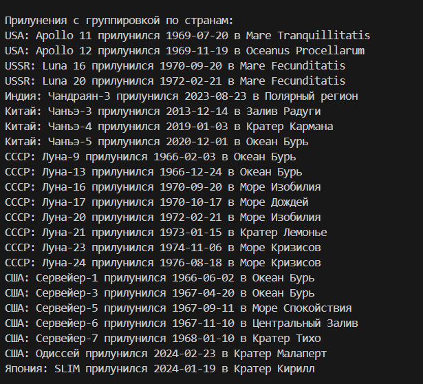
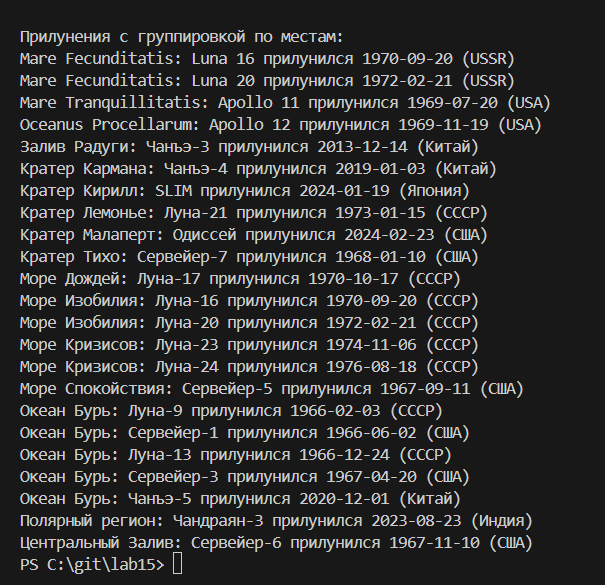

## Лабораторная работа №15: Парсинг и DB API
## Условия задач

- Спроектировать базу данных с использованием crow’s foot notation.
- Реализовать парсер для сбора данных с веб-страницы о мягких посадках на Луну.
- С помощью DB API создать таблицы базы данных и заполнить их данными, полученными с помощью парсера.
- Написать SQL-запросы:
- Топ 5 стран по числу прилунений.
- Прилунения с группировкой по странам.
- Прилунения с группировкой по местам.

## Вариант задания
- Список мягких посадок на Луну (16 миссий) с целью панорамного фотографирования, проведения экспериментов, анализа и доставки лунного   грунта, доставки луноходов. Данные взяты из таблицы на странице Википедии: Список прилунений.
## Таблицы

- Countries: страны (country_id, country_name)
- Spacecraft: космические аппараты (spacecraft_id, spacecraft_name, country_id)
- LandingSites: места прилунений (site_id, site_name)
- Landings: прилунения (landing_id, spacecraft_id, site_id, landing_date)

- Запросы

- Топ 5 стран по числу прилунений.
- Прилунения с группировкой по странам.
- Прилунения с группировкой по местам.

## Описание проделанной работы
1. Проектирование базы данных
Создана база данных с четырьмя таблицами:

Countries: хранит уникальные названия стран.
Spacecraft: хранит названия космических аппаратов и ссылку на страну.
LandingSites: хранит уникальные названия мест прилунения.
Landings: связывает аппараты, места и даты прилунений.

Crow’s Foot Notation:

Countries (1) — (N) Spacecraft: одна страна может запустить много аппаратов.
Spacecraft (1) — (N) Landings: один аппарат может участвовать в нескольких прилунениях.
LandingSites (1) — (N) Landings: одно место может быть использовано для нескольких прилунений.

2. Парсер данных
Данные о мягких посадках на Луну взяты из предоставленной таблицы (16 миссий). Для реального парсинга можно использовать библиотеки requests и BeautifulSoup для извлечения данных из таблицы на странице Википедии. В данном случае данные напрямую включены в код для упрощения.
3. Работа с базой данных

Использован SQLite через модуль sqlite3.
Созданы таблицы с соответствующими полями и внешними ключами.
Данные вставлены с учётом уникальности стран и мест (использован INSERT OR IGNORE).
Реализована обработка данных для предотвращения дублирования.

4. SQL-запросы
Написаны и выполнены три запроса:

Топ 5 стран по числу прилунений (сортировка по убыванию).
Список прилунений, сгруппированный по странам (сортировка по стране и дате).
Список прилунений, сгруппированный по местам (сортировка по месту и дате).

