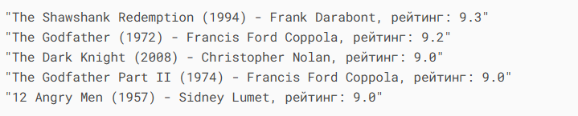
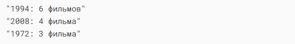
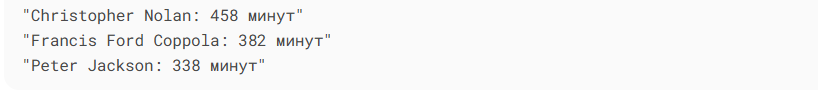
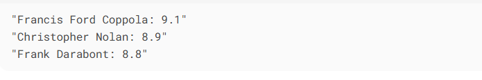
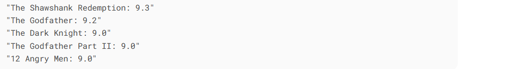

# Лабораторная работа №16: Парсинг данных с IMDb с использованием Selenium

## Цель работы
Разработка парсера для сбора информации о фильмах с сайта IMDb с использованием Selenium WebDriver, сохранение данных в SQLite базе данных и выполнение аналитических запросов с помощью PyPika.

## Описание реализации

### 1. Используемые технологии
- **Selenium WebDriver** - для автоматизации браузера и парсинга данных
- **SQLite3** - для хранения структурированных данных
- **PyPika** - для построения SQL-запросов
- **WebDriver Manager** - для автоматического управления драйверами браузера

### 2. Структура проекта
```
## imdb_parser/
   ├── database.py # Работа с базой данных
   ├── main.py # Основной скрипт
   ├── models.py # Модели данных
   ├── parser.py # Логика парсинга
   ├── queries.py # SQL-запросы через PyPika
   ├── README.md # Отчет
   └── requirements.txt # Зависимости
```

## Результаты






