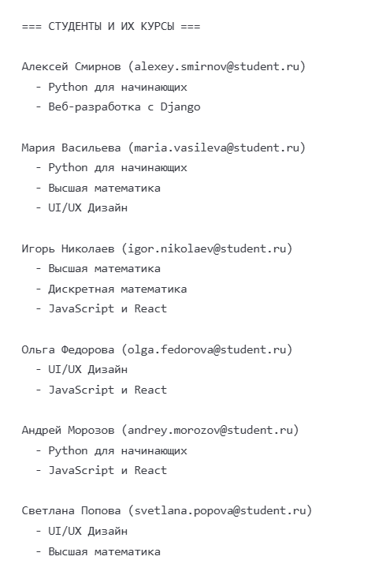
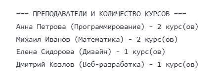
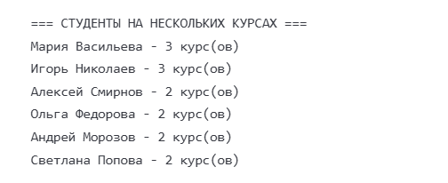
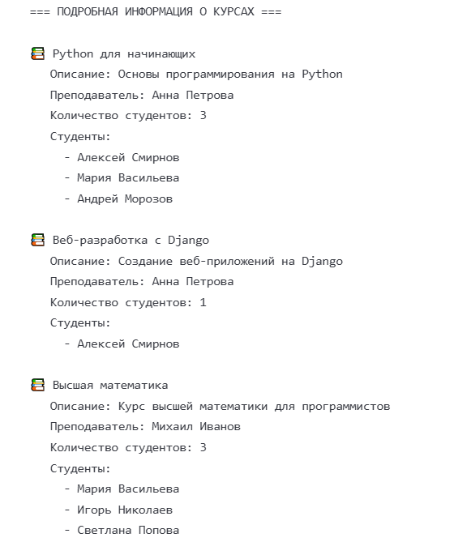

## Лабораторная работа №17: SQLAlchemy ORM
Условие задачи
Тема: Курсы
Спроектировать базу данных для курсов по управлению системами с учетом требований:

Каждый ученик может быть обучен на нескольких курсах
У каждого курса есть ответственный преподаватель
Преподаватель может фактически провести несколько курсов

## Технические требования:

- Спроектировать БД с использованием нотации «гусиной лапки»
- Написать модели данных и создать БД с помощью SQLAlchemy
- Заполнить БД тестовые данные
- Написать запрос на выборку и анализ данных
- Оформить отчёт в README.md с результатом

## Описание проделанной работы
- 1. Проектирование базы данных
- ER-диаграмма в нотации «Гусиная лапка»:
```
ПРЕПОДАВАТЕЛИ           КУРСЫ                    ЗАПИСИ              СТУДЕНТЫ
┌─────────────┐        ┌─────────────┐          ┌─────────────┐      ┌─────────────┐
│ id (PK)     │        │ id (PK)     │          │ student_id  │      │ id (PK)     │
│ first_name  │ ──<    │ title       │    >──── │ course_id   │ ───< │ first_name  │
│ last_name   │        │ description │          │ enroll_date │      │ last_name   │
│ email       │        │ teacher_id  │          └─────────────┘      │ email       │
│ specializ.  │        └─────────────┘                               │ phone       │
└─────────────┘                                                      └─────────────┘
```


- Преподаватели ↔ Курсы : Один ко многим (1 :M )
- Студенты ↔ Курсы : Многие-ко-многим (M :M ) через промежуточную таблицу

## 2. Структура проекта
```
lab17_sqlalchemy/
├── models.py          # Модели данных SQLAlchemy
├── database.py        # Создание и заполнение БД
├── queries.py         # SQL запросы к базе данных
├── main.py           # Главный файл запуска
├── requirements.txt   # Зависимости Python      
└── README.md         # Отчет о работе
```
## Результаты запросов









